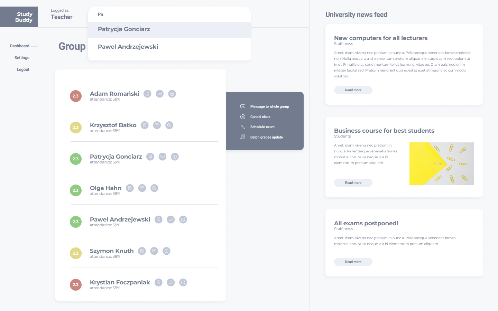

# Hello Roman Study Buddy – React course

## Project prupose

**Studdy Buddy -** an app for college teachers to manage students. It was created while learning React on the [hello roman](https://www.youtube.com/channel/UCq8XmOMtrUCb8FcFHQEd8_g) channel for supporters. The repository contains the code for each of the `26` available lessons and has been divided into separate branches. The main branch contains additional functionality that was not discussed in the course (course assumptions), the last branch related to the course is the `summary-refactor`.



## How to run?

**1. Clone this repository:**

```
git clone https://github.com/KoTubA/hr-study-buddy.git
```

or:

```
git clone git@github.com:KoTubA/hr-study-buddy.git
```

**2. Install npm packages:**

```sql
npm install
```

## How to log in?

All mocked data is located in `src/mocks/db` directory.

To sign in with test user use `teacher@studybuddy.com/Test123` credentials.

## Available Scripts

In the project directory, you can run:

### `npm start`

Runs the app in the development mode.\
Open [http://localhost:3000](http://localhost:3000) and view it in the browser.

The page will reload if you make edits.\
You will also see any lint errors in the console.

### `npm test`

Launches the test runner in the interactive watch mode.\
See the section about [running tests](https://facebook.github.io/create-react-app/docs/running-tests) for more information.

### `npm run test:e2e`

Launches Cypress tests.

### `npm run build`

Builds the app for production to the `build` folder.\
It correctly bundles React in production mode and optimizes the build for the best performance.

The build is minified and the filenames include the hashes.\
Your app is ready to be deployed!

See the section about [deployment](https://facebook.github.io/create-react-app/docs/deployment) for more information.

### `npm storybook`

Launches Storybook on [http://localhost:6006](http://localhost:6006) to view it in the browser. \
The page will reload if you make edits.
